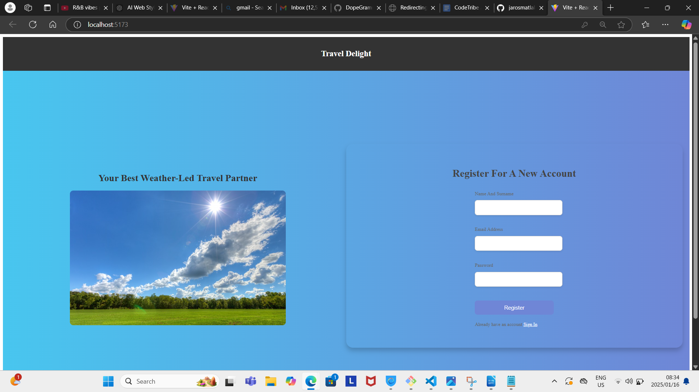
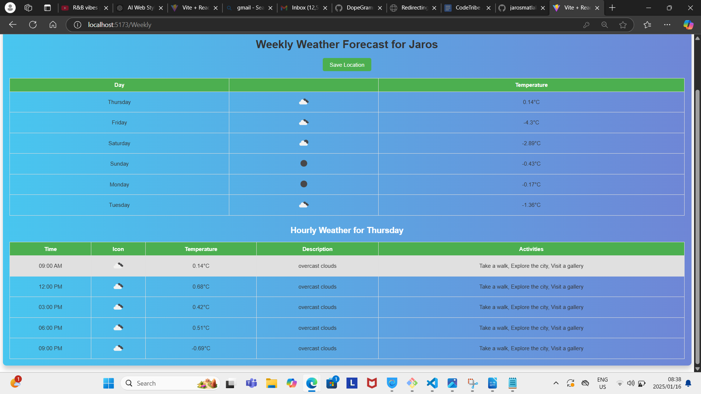
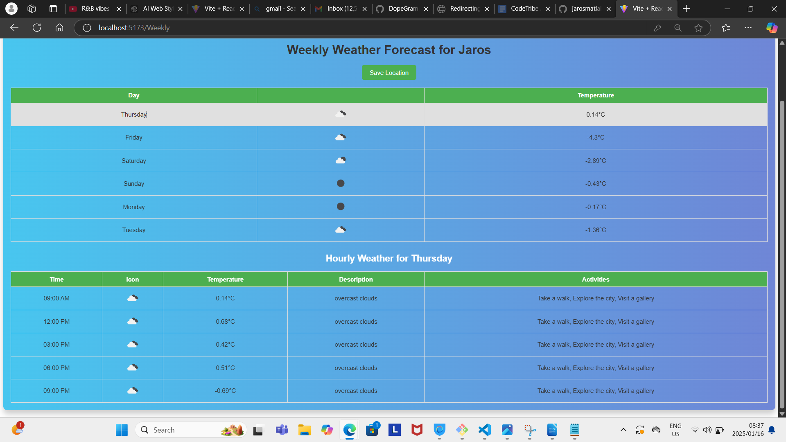
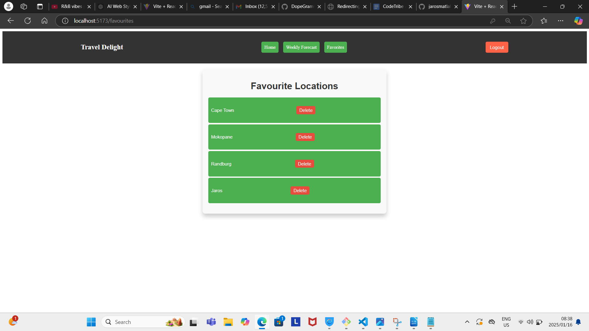

# Weather Application Frontend
This is the frontend of a weather application that provides users with current and 7 Day weather and forecast for cities around the world. It allows users to register, log in, and save their favorite locations.

## Features

- **User Authentication**: Register and log in to to search for favorite locations.


_Registration Screen: Shows the registration Screen ._

- **Weather Data**: View current weather and 7-day forecast for any city.


_Registration Screen: 7-day forecast for any city ._

- **Weekly and Hourly Forecast**: Get detailed weekly and hourly weather data with suggestions for activities.


_Registration Screen: detailed weekly and hourly weather data with suggestions ._

- **Favorites**: Save locations to your favorites list.


_Registration Screen: detailed favourites list with Delete Button ._

## Technologies Used
- **React**: JavaScript library for building the user interface.
- **React Router**: To handle routing and navigation between components.
- **Redux**: For global state management (e.g., storing user data).
- **Axios**: To make HTTP requests to the weather API.
- **CSS**: For styling the application.

## Setup
1. Clone the repository:
    ```
        git clone https://github.com/jarosmatlala/Weather-Based-Travel-Planner-FrontEnd.git
    ```
2. Navigate into the project directory:
    ```
    cd "Weather-Based-Travel-Planner-FrontEnd"
    ```
3. Install dependencies:
    ```
    npm install
    ```
4. Run the application:
    ```
        npm run dev
    ```

## Components

1. **LogIn**:
- Allows the user to log into their account using email and password.
- On successful login, the user is redirected to the main weather page.

2. **WeatherScr**:
- Allows the user to search for a city and view current weather data.
- Displays temperature, humidity, wind speed, and suggestions for activities based on the weather.
- Allows users to switch between Celsius and Kelvin temperature units.

3. **Registration**:
- A form for new users to register with their name, email, and password.
- On successful registration, the user is redirected to the login page.

4. **Weekly**:
- Displays the 7-day weather forecast for the searched city.
- Allows users to click on each day to see hourly forecasts with activity suggestions based on the weather conditions.

5. **Hourly**:
- Displays detailed hourly weather data for a specific day, including the time, temperature, and weather description.
- Offers activity suggestions based on the weather conditions at each hour.

6. **Favourites**:
- Displays a list of cities the user has saved as favorites.
- Allows users to view weather data for their saved locations.

## API Endpoints
The frontend interacts with the following backend endpoints:
- **POST** `/api/users/register`: Registers a new user.
- **POST** `/api/users/login`: Logs in a user.
- **POST** `/api/favourites/save`: Saves a location to the user's list of favorites.

## Documentation 

- To get started with using this application , you will be directed to the Registration page , where the user with have to Register with there Name, email and unique password . 

- After successful registration the user will be prompted to the LogIn screen .
- Please note that you will be required to use the credential you used to register 
- After successful login users will be navigated to the WeatherScr page where they can search for a city name and the press enter to prompt results .
- if happy with the forecast result . the user can hit the switch button to change temperature reading , of press the button written Weekly to access the Weekly forecast .
-To save a location to your favourites you will have to first search the location , View its weekly data then hit save location location to save location.
-To view hourly data select your preferred Day of the week.
-To access your Favourites Location . on the NavBar you can access the Favourites tab and also be able to delete 
